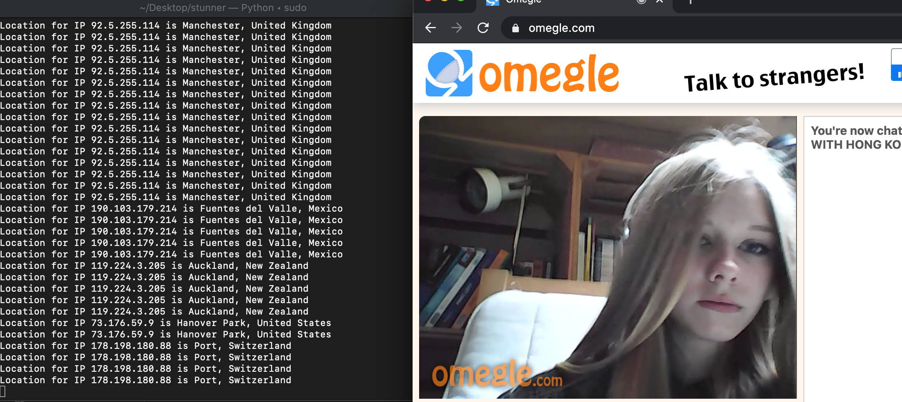
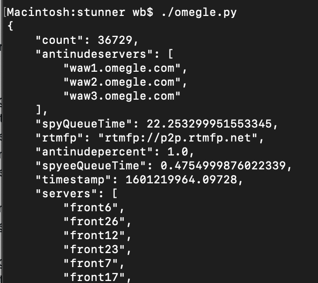

# stunner
Tools to work with STUN protocol. 

* omegle_locate.py
Used to get a WebRTC peer's IP from STUN Binding Success Response(s) and look that IP up in a GeoIP database.
Can be used to show location of an Omegle, Chatroulette, Facebook video, etc. user. It is generic and works 
for any WebRTC or video chat that binds media to peers, and uses the STUN protocol to traverse NAT networks.
It uses raw sockets via Scapy so it requires root or sudo.

To execute: ./omegle_locate.py

Screenshot is below.

* omegle.py
Used to get omegle server status information. Running without an argument queries "chatserv". Use this script
to check status of any server returned by providing that server name as an argument. More information about
the values is here: https://gist.github.com/nucular/e19264af8d7fc8a26ece

Screenshot is below.

